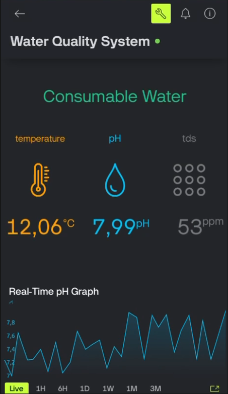
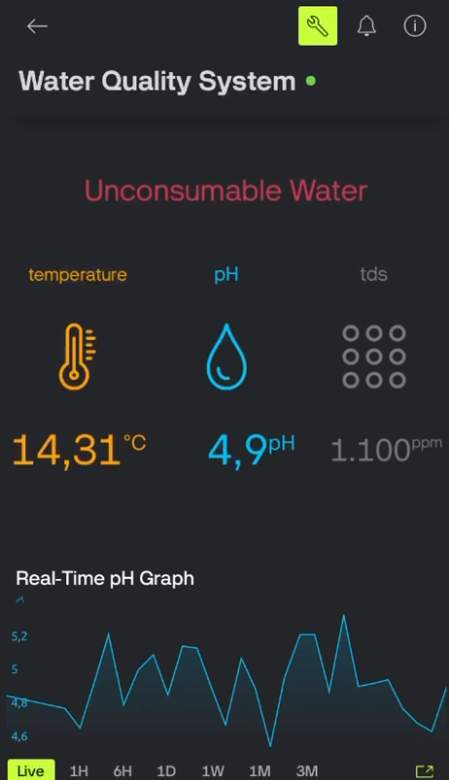

# 💧 IoT Based Water Quality Monitoring System


## 🎓 Project Info
| Course | Group | Semester |
|:---:|:---:|:---:|
| **[COMP413]** | **[G4]** | **[Fall 2025 - 2026]** |

### 👥 Team Members
* **Samet Can ŞAHİN**
* **Serdar Albayrak**
* **Derya İpek ER**

---

## 📖 Overview
Water pollution is a growing challenge in modern cities and industrial areas. This project provides a **low-cost IoT-based solution** for real-time monitoring and analysis of water quality.

The system collects critical parameters such as **pH value, turbidity, and temperature** via sensors, transmits this data to the Cloud, and visualizes it on a user-friendly mobile interface. The primary objective is to detect sudden changes in water quality and alert authorities early.

---

## ⚙️ System Architecture & Hardware
### 🔌 Components List
The following hardware components were used in this project:

| Component | Model / Type | Description |
|---|---|---|
| **Microcontroller** | ESP32 DevKit V1 | Main processor with Wi-Fi capabilities |
| **pH Sensor** | Arduino PH Sensor (Analog) | Measures the acidity/alkalinity of water |
| **Turbidity Sensor** | Analog Turbidity | Measures water clarity/cloudiness |
| **Temp Sensor** | DS18B20 | Waterproof digital temperature sensor |
| **Display** | 0.96" OLED I2C | Local data display (Optional) |

### 📂 Repository Structure
The project files are organized as follows:

* `/src` ➡️ Source code for the microcontroller (ESP32/Arduino).
* `/docs` ➡️ **Detailed Project Report (PDF)** (Includes Introduction, System Model, Hardware/Software Design, and Results).
* `/images` ➡️ Mobile app screenshots, circuit diagrams, and prototype photos.

---

## 🚀 Setup & Installation

Follow these steps to set up the project locally:

1.  **Clone the Repository:**
    ```bash
    git clone [https://github.com/SametCanSahin/COMP413-G4-WaterQualitySystem.git](https://github.com/SametCanSahin/COMP413-G4-WaterQualitySystem.git)
    ```
2.  **Hardware Connection:**
    Connect the sensors to the ESP32 according to the circuit design.
3.  **Install Libraries:**
    Install the following libraries via Arduino IDE: `WiFi.h`, `OneWire`, `DallasTemperature`.
4.  **Configuration:**
    Update the `SSID` and `PASSWORD` credentials in `src/main.ino` to match your network.
5.  **Upload:**
    Upload the code to the board and check the Serial Monitor for the IP address.

---

## 📱 Mobile Interface & Dashboard
Our system monitors water quality status in real-time and displays it through a mobile application interface. Below are the screens for **"Consumable"** (Safe) and **"Unconsumable"** (Unsafe) water statuses:

| ✅ Consumable Water Status | ⚠️ Unconsumable Water Status |
|:---:|:---:|
|  |  |
*(Images: Real-time status display on mobile application)*

---

## 🎥 Demo Video
Watch the 3-minute demonstration video covering hardware setup, sensor testing, and dashboard integration:

[](https://www.youtube.com/watch?v=SXyVbxHDAMM)

*(Click the image above or [here](https://youtu.be/SXyVbxHDAMM) to watch the video)*

---

## 📄 Documentation & Results
For a deep dive into the technical details, algorithms, and analysis of results, please refer to our comprehensive report:

📄 **[Download Full Project Report (PDF)](docs/water_quality_monitoring_system_report.pdf)**

> **Note:** This project was developed as part of the COMP413 Smart City Applications course.